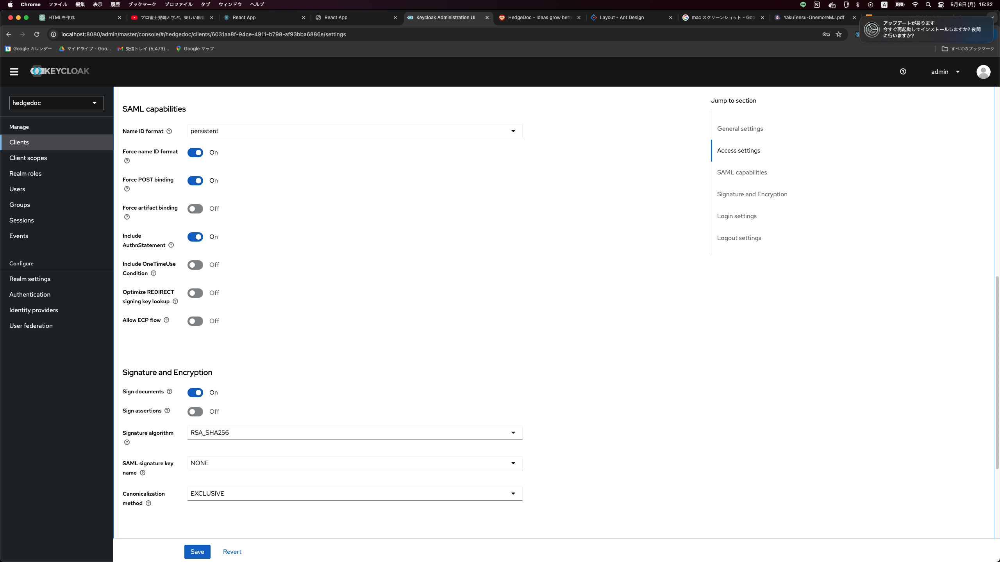

# 起動方法
1. Hedgedoc起動
   1. `cd hedgedoc`
   2. `docker-compose up`

2. Keycloak起動
   1. `cd keycloak`
   2. `docker-compose up`
   3. 設定
      - 
      - 

3. Hedgedocにアクセス
   - URL: `http://localhost:3000`
   - user: `user`
   - password: `pass`

4. ElasticSearch起動
   1. `cd elasticsearch`
   2. `docker-compose up`
   3. [kibana](http://localhost:5601)にアクセス

5. hedgedoc-portal起動
   - [hedgedoc-portal/README.md](./hedgedoc-portal/README.md)を参照