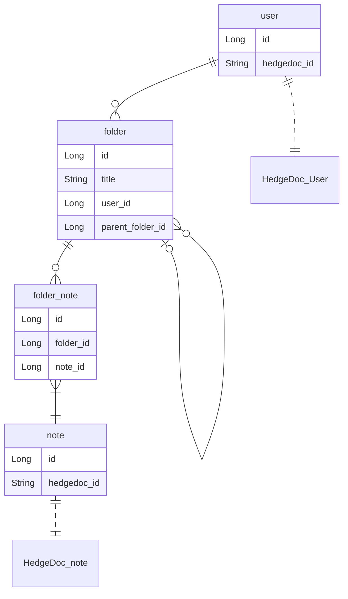
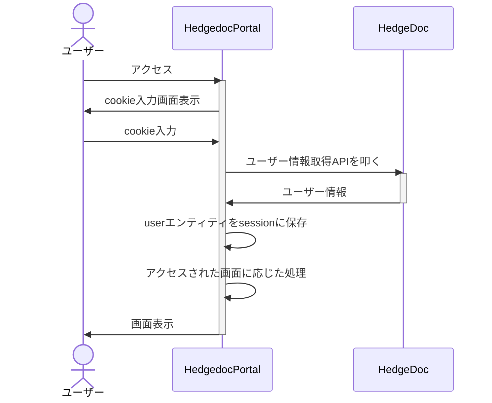

# ER図

# エンティティ
## User
HedgeDocのユーザーと1対1に対応する

|カラム名|タイプ|説明|
|--|--|--|
|id|Long|PK|
|hedgedoc_id|String|HegeDocのユーザーのID|

### ユーザー情報取得の流れ

## Folder
HedgeDocのノートを格納するエンティティ

|カラム名|タイプ|説明|
|--|--|--|
|id|Long|PK|
|title|String|フォルダのタイトル|
|user_id|Long|所有するユーザーのID(FK)|
|parent_folder_id|Long|親フォルダのID(FK)|

- フォルダは親子構造をとる
- 一番階層が上のフォルダはparent_folder_idがnull

## FolderNote
FolderとNoteの中間テーブル

|カラム名|タイプ|説明|
|--|--|--|
|id|Long|PK|
|folder_id|Long|FK|
|note_id|Long|FK|

## Note
HedgeDocのユーザーと1対1に対応する

|カラム名|タイプ|説明|
|--|--|--|
|id|Long|PK|
|hedgedoc_id|String|HedgeDocのノートのID(FK)|

- トップページでHedgeDocから履歴を取得する際、DBに存在しなければ作成する